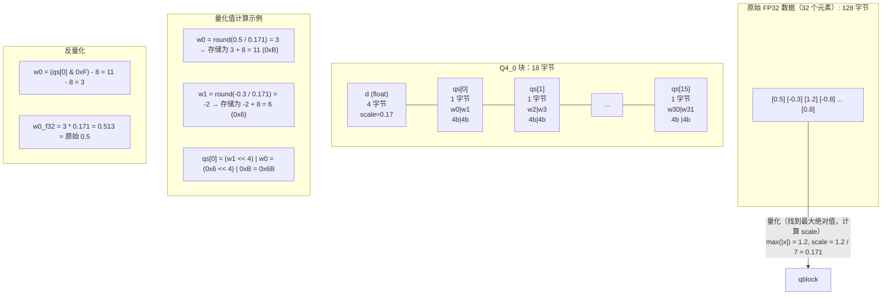

# 第5章 量化技术深度解析 —— 模型压缩的"瘦身魔法"

大语言模型（LLM）的参数规模从数十亿到数千亿不等，原版 FP32 模型需要数十 GB 甚至上百 GB 的内存。量化技术（Quantization）通过降低数值精度，将模型压缩到原来的 1/4 甚至 1/8，使得消费级硬件也能运行大模型。本章将深入解析 GGML 的量化原理和实现。

## 学习目标

1. 理解量化原理（对称/非对称、位数选择）
2. 掌握 GGML 量化块的内存布局与计算方式
3. 了解 Q4_0 到 Q8_0 各类量化格式的区别
4. 能根据场景选择最佳量化策略

## 生活类比

想象你经营着一座巨大的数字图书馆。在这个比喻中，原始的 FP32 模型就像是每本书都用高清彩色印刷的珍藏版本——每页耗费 4 个字节的纸张，质量最高但占满了巨大的书架空间。而量化压缩技术就是把这座图书馆里的每一本书都转换成精简版本的过程。

具体来说，不同的量化级别就像是不同的精简策略：Q8_0 相当于高保真扫描，每页只用 1 个字节，画质接近原版，适合珍贵藏书的长期保存；Q4_0 则是精要摘录，每页压缩到仅 4 比特，体积缩小到原来的四分之一，质量依然可以接受，适合日常阅读；Q4_K_M 更进一步，采用智能摘要技术，对重要章节保留高保真度，对次要章节进行深度压缩，是平衡之选。

在压缩过程中，量化块（block）扮演着关键角色——图书馆管理员将每 64 页编为一组，每组共用一套"缩放说明书"（scale 参数），这样就不需要为每一页单独记录换算比例。反量化则是在读者打开书本时，根据说明书将精简内容还原为可阅读的格式。而 IQ 系列则代表了更高级的智能压缩算法，它能根据内容的重要性动态调整每一段的精度分配，在极致的压缩比下仍保持核心内容的清晰度。

就像图书馆管理员需要在"藏书数量"和"阅读质量"之间做出权衡一样，大模型部署也需要在"模型体积"和"推理质量"这两个指标之间找到最优的平衡点。

---

## 5.1 量化原理概述

### 5.1.1 为什么要量化？

**内存对比**（以 7B 模型为例）：

| 格式 | 每参数位数 | 模型大小 | 加载所需 RAM | 适用场景 |
|-----|-----------|---------|------------|---------|
| FP32 | 32 | 28 GB | ~32 GB | 训练 |
| FP16 | 16 | 14 GB | ~16 GB | 混合精度训练 |
| Q8_0 | 8 | 7 GB | ~8 GB | 高精度推理 |
| Q4_K_M | 4 | 3.8 GB | ~4.5 GB | 桌面/笔记本 |
| Q4_0 | 4 | 3.5 GB | ~4 GB | 平衡之选 |
| IQ2_XXS | 2 | 1.75 GB | ~2.5 GB | 手机/嵌入式 |

从表中可以看到，Q4_K_M 将模型从 28GB 压缩到 3.8GB，压缩比达到 7:1，而质量损失通常在可接受范围内。

### 5.1.2 对称量化 vs 非对称量化

**对称量化（Symmetric）**：

```
量化公式：
    q = round(x / scale)
    其中 scale = max(|x|) / 7  (对于4-bit，范围[-7, 7])

反量化：
    x' = q * scale

存储：
    - 每块存储：scale（float32）+ quantized_weights（int4/int8）
    - 无需 zero point
```

对称量化适用于数据分布大致以零为中心的场景，实现简单，计算高效。

**非对称量化（Asymmetric）**：

```
量化公式：
    q = round((x - zero) / scale)
    其中 scale = (max - min) / 15, zero = min

反量化：
    x' = q * scale + zero

存储：
    - 每块存储：scale + zero_point + quantized_weights
    - 适合数据分布不对称的场景
```

非对称量化更适合数据分布明显偏向某一侧的情况，但需要额外存储 zero 点。

**GGML 实现对比**：

| 类型 | 量化方式 | 每块字节数 | 适用场景 |
|-----|---------|-----------|---------|
| Q4_0 | 对称 | 18 | 通用，权重分布对称 |
| Q4_1 | 非对称 | 24 | 激活值，分布不对称 |
| Q5_0 | 对称 | 22 | 更高精度需求 |
| Q5_1 | 非对称 | 28 | 非对称激活值 |
| Q8_0 | 对称 | 36 | 高精度，激活常用 |

---

## 5.2 GGML 量化实现

### 5.2.1 量化块（Block）结构 —— 压缩的基本单元

**核心思想**：将连续的一组权重（通常 32 个）打包成一个"块"，每块共享一个缩放因子。

#### Q4_0 块结构详解

**源码位置**：`ggml/include/ggml.h`（第 400-420 行）

```c
// Q4_0: 4-bit 对称量化，32 个元素/块
// 压缩率：32 个 FP32(128 字节) -> 18 字节，压缩比 ~7x

struct block_q4_0 {
    float d;              // delta/scale，4 字节
    uint8_t qs[16];       // 32 个 4 位权重，打包成 16 字节
                          // qs[i] 的低 4 位 = 权重 2*i
                          // qs[i] 的高 4 位 = 权重 2*i+1
};
// 总大小：4 + 16 = 20 字节（可能有 2 字节对齐填充）

这段代码定义了Q4_0量化块结构。每块包含32个权重，使用4位整数存储，并共享一个FP32缩放因子。32个FP32原需128字节，量化后仅需18字节，压缩比约7:1，是平衡质量与体积的常用格式。
```

**内存布局图解**：



#### Q4_1 块结构（非对称）

**源码位置**：`ggml/include/ggml.h`（第 420-440 行）

```c
// Q4_1: 4-bit 非对称量化，32 个元素/块
struct block_q4_1 {
    float d;              // delta/scale
    float m;              // min/zero point
    uint8_t qs[16];       // 32 个 4 位权重
};
// sizeof(block_q4_1) = 4 + 4 + 16 = 24 字节

// 反量化公式：
// weight[i] = ((qs[i/2] >> (4*(i%2))) & 0xF) * d + m
// 范围映射到 [m, m+15*d]

这段代码定义了Q4_1非对称量化块结构。相比Q4_0额外存储最小值m，使量化范围映射到[m, m+15*d]而非对称区间，更适合分布不对称的激活值，但增加了约33%的存储开销。
```

### 5.2.2 量化过程详解

**源码位置**：`ggml/src/ggml-quants.c` - `quantize_row_q4_0_reference()`（第 1000-1100 行）

```c
// 量化一行 FP32 数据为 Q4_0
void quantize_row_q4_0_reference(
    const float * x,           // 输入：原始 FP32 数据
    block_q4_0 * y,            // 输出：量化后的块数组
    int64_t k) {               // 元素数量（必须是 32 的倍数）

    const int64_t nb = k / QK4_0;  // 块数 = 元素数 / 每块元素数

    for (int64_t i = 0; i < nb; i++) {
        // ① 找到当前块的最大绝对值
        float amax = 0.0f;
        for (int l = 0; l < QK4_0; l++) {
            const float v = x[i*QK4_0 + l];
            amax = fmaxf(amax, fabsf(v));
        }

        // ② 计算 scale（d = max / 7，因为 4 位对称范围是[-7, 7]）
        const float d = amax / 7.0f;
        const float id = d ? 1.0f/d : 0.0f;
        y[i].d = d;

        // ③ 量化每个元素并打包
        for (int l = 0; l < QK4_0; l += 2) {
            // 映射到[0, 15]范围
            const float v0 = x[i*QK4_0 + l + 0]*id;
            const float v1 = x[i*QK4_0 + l + 1]*id;

            const uint8_t vi0 = (int8_t)roundf(v0) + 8;  // [-7, 7] -> [1, 15]
            const uint8_t vi1 = (int8_t)roundf(v1) + 8;

            // 打包成一个字节：高 4 位 | 低 4 位
            y[i].qs[l/2] = (vi0 & 0xF) | ((vi1 & 0xF) << 4);
        }
    }
}

这段代码实现了Q4_0量化算法。对每个32元素块：1)计算最大绝对值确定缩放因子；2)将FP32值映射到[-7,7]整数范围；3)将两个4位值打包到一个字节。通过共享scale实现高效压缩。
```

### 5.2.3 量化矩阵乘法 —— 在压缩空间计算

**核心优化**：两个量化矩阵相乘时，不需要完全反量化，可以部分展开计算。

**源码位置**：`ggml/src/ggml-quants.c` - `ggml_vec_dot_q4_0_q8_0()`（第 3000-3200 行）

```c
// 计算两个量化向量的点积
// x: Q4_0 量化向量（来自权重矩阵）
// y: Q8_0 量化向量（来自激活，通常 Q8 精度更高）
float ggml_vec_dot_q4_0_q8_0(
    int n,                      // 向量长度
    const block_q4_0 * x,       // 量化权重
    const block_q8_0 * y) {     // 量化激活

    float sumf = 0.0f;
    const int nb = n / QK8_0;   // 块数

    for (int i = 0; i < nb; i++) {
        // ① 获取每块的 scale
        const float dx = x[i].d;  // Q4_0 scale
        const float dy = y[i].d;  // Q8_0 scale

        // ② 计算块内点积（在整数空间，更快）
        int sumi = 0;
        for (int j = 0; j < QK4_0/2; j++) {
            // 解包 Q4_0 的两个 4 位权重
            const uint8_t v = x[i].qs[j];
            const int vi0 = (v & 0xF) - 8;    // 低 4 位
            const int vi1 = (v >> 4) - 8;     // 高 4 位

            // 对应的 Q8_0 值（8 位，已存储）
            const int yi0 = y[i].qs[2*j + 0];
            const int yi1 = y[i].qs[2*j + 1];

            // 整数点积累加（无浮点运算，速度快）
            sumi += vi0 * yi0 + vi1 * yi1;
        }

        // ③ 应用 scale（只在最后一步用浮点）
        sumf += sumi * dx * dy;
    }

    return sumf;
}

这段代码实现了Q4_0与Q8_0量化向量的点积计算。核心优化包括：1)在整数域计算点积避免浮点运算；2)延迟反量化只在最后乘以scale；3)每次处理两个4位权重提高指令级并行。这种设计使量化推理速度接近FP16。
```

**优化要点**：

1. **块级计算**：按块计算，复用 scale
2. **整数点积**：大部分计算在整数域，比浮点快 3-5 倍
3. **延迟反量化**：只在最后一步乘以 scale，减少浮点运算

---

## 5.3 各类量化格式对比

### 5.3.1 基础量化类型

**源码位置**：`ggml/include/ggml.h`（第 200-250 行）

```c
enum ggml_type {
    GGML_TYPE_F32  = 0,   // 32 位浮点
    GGML_TYPE_F16  = 1,   // 16 位浮点
    GGML_TYPE_Q4_0 = 2,   // 4 位对称，32 元素/块，18 字节/块
    GGML_TYPE_Q4_1 = 3,   // 4 位非对称，32 元素/块，24 字节/块
    GGML_TYPE_Q5_0 = 6,   // 5 位对称，32 元素/块，22 字节/块
    GGML_TYPE_Q5_1 = 7,   // 5 位非对称，32 元素/块，28 字节/块
    GGML_TYPE_Q8_0 = 8,   // 8 位对称，32 元素/块，36 字节/块
    GGML_TYPE_Q8_1 = 9,   // 8 位非对称，32 元素/块，40 字节/块
};

这段代码枚举了GGML支持的主要数据类型。从F32/F16浮点类型到Q4-Q8各种位宽的量化类型，每种类型有不同的块大小和存储开销，用户可根据精度和压缩需求选择合适类型。
```

| 类型 | 位宽 | 块大小 | 块字节数 | 压缩比 | 适用场景 |
|-----|------|-------|---------|-------|---------|
| FP32 | 32 | - | 4 | 1x | 训练 |
| FP16 | 16 | - | 2 | 2x | 混合精度 |
| Q8_0 | 8 | 32 | 36 | 3.5x | 高精度推理 |
| Q5_0 | 5 | 32 | 22 | 5.8x | 中等精度 |
| Q4_0 | 4 | 32 | 18 | 7.1x | 平衡之选 |
| Q4_1 | 4 | 32 | 24 | 5.3x | 非对称分布 |

### 5.3.2 K-quants 系列

K-quants 是改进的量化方案，使用更大的块（256 元素）和更复杂的 scale 分配策略，在相同比特数下获得更高质量。

| 类型 | 描述 | 质量 |
|-----|------|------|
| Q2_K | 2-bit K-quant | 基础质量 |
| Q3_K | 3-bit K-quant | 中等质量 |
| Q4_K_M | 4-bit K-quant 混合 | 推荐！平衡之选 |
| Q5_K_M | 5-bit K-quant 混合 | 高质量 |
| Q6_K | 6-bit K-quant | 接近 FP16 |

**K-quants 的秘密**：

| 类型 | scale 策略 | 描述 |
|------|-----------|------|
| 普通 Q4_0 | 32 元素共享 1 个 scale | 简单直接 |
| Q4_K_M | 256 元素分层量化 | 每 32 元素有小 scale，整组 256 元素有大 scale，重要权重（如 attention）用更高精度 |

### 5.3.3 IQ（改进量化）系列

**IQ2_XXS**：极致压缩方案

- 目标：手机/嵌入式部署
- 技巧：
  1. 大部分权重用 2-bit
  2. 异常值（outliers）用更高精度存储
  3. 使用重要性矩阵（imatrix）指导量化

**源码位置**：`ggml/src/ggml-quants.c`（第 5000+ 行）

---

## 5.4 设计中的取舍

### 为什么 Q4_0 块大小是 32 而不是 64 或 256？

| 块大小 | 优点 | 缺点 | GGML 选择 |
|-------|------|------|-----------|
| 16 | scale 精度高 | 开销大（25%） | ❌ |
| 32 | 平衡 | 平衡 | ✅ 是 |
| 64 | 开销小（6%） | 局部精度损失 | 部分使用 |
| 256 | 开销极小 | 长尾效应明显 | K-quants 使用 |

**Q4_0 (32 元素/块)**：
- 开销：18 字节存储 32 个数，vs 128 字节原始 = 14% overhead
- 局部性：32 个连续的权重通常分布相似，共享 scale 合理

**K-quants (256 元素/块)**：
- 开销更低，但用更复杂的分层 scale 策略补偿精度损失

### 为什么量化激活常用 Q8_0 而不是 Q4_0？

| 类型 | 量化策略 | 特点 |
|------|---------|------|
| 权重矩阵 W | Q4_0 量化 | 静态，只读 |
| 激活向量 x | Q8_0 量化 | 动态，每次推理不同 |

**原因：**
1. 激活比权重对精度更敏感（动态范围大）
2. Q8_0 * Q8_0 的矩阵乘法更快（SIMD 友好）
3. 激活占用内存少，量化到 8 位收益足够
4. 权重量化到 4 位收益更大（参数数量大）

---

## 5.5 动手练习

### 练习 1：计算量化后大小

给定一个形状为 `[4096, 4096]` 的 FP32 矩阵，计算：

1. 原始大小（字节）= 4096 * 4096 * 4 = 67,108,864 字节 ≈ 64 MB
2. Q4_0 量化后大小 = (4096 * 4096 / 32) * 18 = 9,437,184 字节 ≈ 9 MB
3. Q8_0 量化后大小 = (4096 * 4096 / 32) * 36 = 18,874,368 字节 ≈ 18 MB
4. 验证：`ggml_type_size(GGML_TYPE_Q4_0)` 应返回 18

### 练习 2：理解量化误差

阅读 `tests/test-quantize-perf.cpp`，运行量化精度测试：

```bash
./test-quantize-perf
```

观察不同量化类型的误差指标（RMSE、cosine similarity），思考：
- 哪种量化类型的误差最小？
- 误差与压缩比之间是什么关系？

### 练习 3：设计新的量化格式

假设你要设计一种新的量化格式 `Q3_0`（3-bit 对称量化），回答：

1. **每块多少元素最合适？**
   - 考虑：32 元素可得到 96 位 / 32 = 3 位/元素，但需要存储 scale
   - 建议：32 元素/块，12 字节存储权重 + 4 字节 scale = 16 字节/块

2. **块结构如何定义？**
   ```c
   struct block_q3_0 {
       float d;           // scale, 4 字节
       uint8_t qs[12];    // 32 * 3bit = 96bit = 12 字节
   };
   ```

3. **压缩比是多少？**
   - 原始：128 字节
   - 压缩后：16 字节
   - 压缩比：8x

4. **反量化公式？**
   ```c
   // 需要位操作解包 3 位值
   int q = (qs[i/8] >> (3*(i%8))) & 0x7;
   float val = (q - 4) * d;  // 映射[-4, 3]
   ```

---

## 5.6 本章小结

本章全面介绍了 llama.cpp 的量化技术体系。Q4_0 采用 4 位对称量化，每块包含 32 个元素，压缩比达到 7 倍，每块体积 18 字节。Q4_1 使用 4 位非对称量化，额外存储 min 值，更适合处理不对称分布的数据。block_q4_0 定义了量化块的结构，包含一个 float 类型的 scale 和 16 字节打包权重。quantize_row 函数实现量化流程：找最大值计算 scale，将数据映射到 [-7, 7] 范围，然后打包存储。vec_dot_q4_0 采用整数点积加延迟 scale 的方式，是效率最高的量化计算方法。K-quants 采用分层量化策略，使用更大的块和复杂的 scale 分配机制，在保证质量的同时实现更高压缩。IQ 系列采用智能混合精度，对重要权重使用高精度表示，实现极致压缩效果。

量化选择建议：服务器和追求精度的场景推荐使用 Q8_0 或 Q6_K；桌面环境推荐 Q4_K_M 作为平衡之选；笔记本轻度使用可选 Q4_0；手机和嵌入式设备建议使用 IQ2_XXS 或 Q2_K。

本章我们一起学习了以下概念：

| 概念 | 解释 |
|------|------|
| 对称量化 | 以零为中心的映射方式，只需存储 scale，简单高效 |
| 非对称量化 | 含零点偏移的映射方式，额外存储 min 值，适合偏态分布数据 |
| Q4_0 量化块 | 32个元素共享一个FP32缩放因子，18字节/块，压缩比约7:1 |
| 整数域点积 | 量化矩阵乘法的核心优化，在整数域完成计算后仅最后乘一次 scale |
| K-quants | 使用256元素大块和分层scale策略，在相同比特数下获得更高质量 |
| IQ 系列 | 基于重要性矩阵的智能混合精度量化，对重要权重保留更高精度 |

下一章中，我们将学习 GGML 后端系统——理解异构计算的抽象架构和 CPU/GPU 后端的工作原理。
