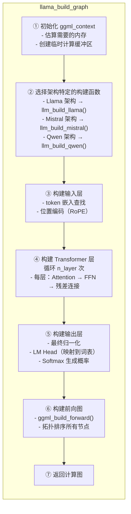

# 第9章 计算图构建（llama_graph） —— Transformer的"动态组装工厂"

大语言模型的核心是一个复杂的深度神经网络，如何将其转换为可执行的计算图是推理的关键。llama.cpp 的 `llama_graph` 模块负责将模型架构配置动态组装成 GGML 计算图。本章将深入解析这一过程。

## 学习目标

1. 理解 `llama_build_graph` 的架构设计
2. 掌握 Transformer 层计算图的构建过程
3. 了解图优化技术（算子融合、常量折叠）
4. 能调试和可视化计算图

## 生活类比：乐高积木的自动化工厂

想象 `llama_graph` 是一家智能乐高工厂。计算图构建器就像自动组装机器人，它根据"设计图纸"（模型架构配置），从"零件仓库"（`ggml_context`）中取出预先准备好的各种尺寸的积木块（张量），然后按照"组装说明书"（Transformer 算法）一步一步地搭建出完整的模型结构。`ggml_context` 这个零件仓库不仅存储了张量，还负责按需求分配存储空间，确保每个计算步骤都有足够的"零件"可用。

在这条流水线上，每个计算节点都是一个加工工位：词嵌入工位负责把 token ID 变成向量表示，Transformer 层工位进行特征提取，输出工位则生成下一个 token 的概率分布。几十个工位首尾相连，形成一个完整的加工流水线，张量在这条流水线上流动，逐步被加工成最终的结果。

为了让这条流水线运转得更高效，llama_graph 还配备了图优化系统——就像工厂的智能排产系统。它会把相邻的小工序合并成一个（算子融合），把不依赖输入的固定值提前算好（常量折叠），还会去掉那些不会影响最终输出的无用步骤（死代码消除）。就像工厂需要精确安排每个零件的加工顺序，llama_graph 需要精确构建每个张量的计算依赖，确保计算图既正确又高效。

---

## 9.1 推理计算图设计

### 9.1.1 图构建器架构

**源码位置**：`src/llama-graph.h`（第 1-100 行）

```cpp
// 图构建上下文
struct llm_build_context {
    // 输入
    const llama_hparams & hparams;    // 模型超参数
    const llama_model   & model;      // 模型数据
    const llama_batch   & batch;      // 输入批次
    const llama_kv_cache& kv_cache;   // KV 缓存

    // GGML 上下文（张量仓库）
    struct ggml_context * ctx0;

    // 构建的计算图
    struct ggml_cgraph * graph;

    // 位置编码参数
    float freq_scale;
    float freq_base;
    float ext_factor;
    float attn_factor;
    float beta_fast;
    float beta_slow;
};

// 主构建函数入口
struct ggml_cgraph * llama_build_graph(
        llama_context * lctx,
        const llama_batch & batch,
        bool worst_case);  // 为最坏情况分配（最大 batch）
```

### 9.1.2 图构建流程概览



---

## 9.2 前向传播实现

### 9.2.1 Llama 架构构建入口

**源码位置**：`src/llama-graph.cpp`（第 500-800 行）

```cpp
// Llama 架构计算图构建
static struct ggml_cgraph * llm_build_llama(
        llama_context * lctx,
        const llama_batch & batch) {

    struct llm_build_context * bctx = (struct llm_build_context *)lctx;
    const llama_hparams & hparams = bctx->hparams;
    const int n_layer = hparams.n_layer;

    // ① 创建输入嵌入
    struct ggml_tensor * inp_tokens = ggml_new_tensor_1d(
        bctx->ctx0, GGML_TYPE_I32, batch.n_tokens);

    // 词嵌入查找：token ID → embedding 向量
    struct ggml_tensor * inpL = ggml_get_rows(bctx->ctx0,
        bctx->model.tok_embd,   // 词嵌入矩阵 [n_embd, n_vocab]
        inp_tokens);            // token 索引 [n_tokens]

    // ② 遍历每一层 Transformer
    for (int il = 0; il < n_layer; il++) {
        struct ggml_tensor * cur = inpL;

        // ========== Attention 层 ==========
        {
            // 输入归一化
            cur = ggml_rms_norm(bctx->ctx0, cur, hparams.f_norm_rms_eps);
            bctx->inpSA = cur;  // 保存用于后续

            // Q 投影: [n_embd, n_tokens] @ [n_embd, n_embd]
            struct ggml_tensor * Q = ggml_mul_mat(bctx->ctx0,
                bctx->model.layers[il].wq, cur);

            // K 投影
            struct ggml_tensor * K = ggml_mul_mat(bctx->ctx0,
                bctx->model.layers[il].wk, cur);

            // V 投影
            struct ggml_tensor * V = ggml_mul_mat(bctx->ctx0,
                bctx->model.layers[il].wv, cur);

            // 应用 RoPE 位置编码
            Q = ggml_rope(bctx->ctx0, Q, bctx->pos, ...);
            K = ggml_rope(bctx->ctx0, K, bctx->pos, ...);

            // 注意力计算
            struct ggml_tensor * attn_out = llm_build_attn(Q, K, V, ...);

            // 输出投影
            cur = ggml_mul_mat(bctx->ctx0,
                bctx->model.layers[il].wo, attn_out);

            // 残差连接
            cur = ggml_add(bctx->ctx0, cur, inpL);
        }

        // ========== FFN 层 ==========
        {
            struct ggml_tensor * tmp = cur;

            // 归一化
            cur = ggml_rms_norm(bctx->ctx0, cur, hparams.f_norm_rms_eps);

            // SwiGLU: gate = SiLU(Wg @ x) * (Wu @ x)
            struct ggml_tensor * gate = ggml_mul_mat(bctx->ctx0,
                bctx->model.layers[il].wgate, cur);
            gate = ggml_silu(bctx->ctx0, gate);

            struct ggml_tensor * up = ggml_mul_mat(bctx->ctx0,
                bctx->model.layers[il].wup, cur);

            cur = ggml_mul(bctx->ctx0, gate, up);

            // 下投影
            cur = ggml_mul_mat(bctx->ctx0,
                bctx->model.layers[il].wdown, cur);

            // 残差连接
            cur = ggml_add(bctx->ctx0, cur, tmp);
        }

        inpL = cur;  // 下一层的输入
    }

    // ③ 输出层
    {
        // 最终归一化
        inpL = ggml_rms_norm(bctx->ctx0, inpL, hparams.f_norm_rms_eps);

        // LM Head：映射到词表大小
        struct ggml_tensor * logits = ggml_mul_mat(bctx->ctx0,
            bctx->model.output, inpL);

        // 提取目标 token 的 logits
        bctx->inpl_logits = logits;
    }

    // ④ 构建前向图（拓扑排序）
    struct ggml_cgraph * graph = ggml_build_forward(bctx->inpl_logits);

    return graph;
}

这段代码实现了Llama架构的完整计算图构建。流程包括：1)创建token嵌入；2)循环遍历每层Transformer，依次构建RMSNorm、Q/K/V投影、RoPE位置编码、注意力计算、残差连接、SwiGLU FFN；3)输出层归一化和LM Head；4)最终构建前向计算图。
```

### 9.2.2 多头注意力实现

**源码位置**：`src/llama-graph.cpp`（第 2000-2300 行）

```cpp
// 注意力层构建
struct ggml_tensor * llm_build_attn(
        struct llm_build_context * bctx,
        struct ggml_tensor * Q,
        struct ggml_tensor * K,
        struct ggml_tensor * V,
        int il) {  // 层索引

    const llama_hparams & hparams = bctx->hparams;
    const int n_head = hparams.n_head;
    const int n_head_kv = hparams.n_head_kv;
    const int n_embd_head = hparams.n_embd_head();

    // ① 维度重塑：分离 head 维度
    // Q: [n_embd, n_tokens] → [n_embd_head, n_head, n_tokens]
    Q = ggml_reshape_3d(bctx->ctx0, Q, n_embd_head, n_head, Q->ne[1]);
    K = ggml_reshape_3d(bctx->ctx0, K, n_embd_head, n_head_kv, K->ne[1]);
    V = ggml_reshape_3d(bctx->ctx0, V, n_embd_head, n_head_kv, V->ne[1]);

    // ② KV 缓存更新
    // 将当前 K,V 追加到 KV 缓存中
    struct ggml_tensor * k_cache = bctx->kv_cache.k_l[il];
    struct ggml_tensor * v_cache = bctx->kv_cache.v_l[il];

    // K = [K_cache, K_new]
    K = ggml_kv_cache_concat(bctx->ctx0, k_cache, K);
    V = ggml_kv_cache_concat(bctx->ctx0, v_cache, V);

    // ③ 计算注意力分数: Q @ K^T / sqrt(d_k)
    struct ggml_tensor * KQ = ggml_mul_mat(bctx->ctx0, K, Q);
    KQ = ggml_scale(bctx->ctx0, KQ, 1.0f / sqrtf(n_embd_head));

    // ④ 应用注意力掩码（causal mask）
    // 防止 attend 到未来的 token
    KQ = ggml_diag_mask_inf(bctx->ctx0, KQ, 0);  // 上三角设为 -inf

    // ⑤ Softmax 归一化
    KQ = ggml_soft_max(bctx->ctx0, KQ);

    // ⑥ 加权求和: Attention @ V
    struct ggml_tensor * KQV = ggml_mul_mat(bctx->ctx0, V, KQ);

    // ⑦ 重塑回原始维度
    // [n_embd_head, n_head, n_tokens] → [n_embd, n_tokens]
    KQV = ggml_reshape_2d(bctx->ctx0, KQV, hparams.n_embd, KQV->ne[2]);

    return KQV;
}
```

**注意力计算流程图解**：

```
输入: Q, K, V (每个形状: [n_embd, n_tokens])

Step 1: 分离 head
    Q → reshape → [head_dim, n_head, n_tokens]
    K → reshape → [head_dim, n_kv_head, n_tokens]
    V → reshape → [head_dim, n_kv_head, n_tokens]

Step 2: 拼接 KV 缓存
    K_cache + K → [head_dim, n_kv_head, n_cache + n_tokens]
    V_cache + V → [head_dim, n_kv_head, n_cache + n_tokens]

Step 3: 计算注意力分数
    Q @ K^T → [n_head, n_tokens, n_cache + n_tokens]

Step 4: 掩码 + Softmax
    → 应用 causal mask
    → softmax → 概率分布

Step 5: 加权求和
    attention @ V → [head_dim, n_head, n_tokens]

Step 6: 合并 heads
    → reshape → [n_embd, n_tokens]
```

### 9.2.3 FFN 层实现

**源码位置**：`src/llama-graph.cpp`（第 2500-2700 行）

```cpp
// SwiGLU FFN 构建
struct ggml_tensor * llm_build_ffn(
        struct llm_build_context * bctx,
        struct ggml_tensor * cur,
        int il) {

    const llama_hparams & hparams = bctx->hparams;
    const llama_layer & layer = bctx->model.layers[il];

    // SwiGLU 结构: Swish(Wg @ x) * (Wu @ x) @ Wd

    // 门控分支
    struct ggml_tensor * gate = ggml_mul_mat(bctx->ctx0, layer.wgate, cur);
    gate = ggml_silu(bctx->ctx0, gate);  // SiLU 激活

    // 上采样分支
    struct ggml_tensor * up = ggml_mul_mat(bctx->ctx0, layer.wup, cur);

    // 逐元素相乘（门控）
    struct ggml_tensor * activated = ggml_mul(bctx->ctx0, gate, up);

    // 下投影
    struct ggml_tensor * output = ggml_mul_mat(bctx->ctx0, layer.wdown, activated);

    return output;
}
```

---

## 9.3 图优化技术

### 9.3.1 算子融合

**原理**：将相邻的轻量算子合并为一个 kernel，减少内存访问。

```cpp
// 融合前（两次内存读写）:
// tmp = x + y
// z = tmp * scale

// 融合后（一次内存读写）:
// z = (x + y) * scale

// GGML 中的融合算子示例:
ggml_add_mul()        // 加法 + 乘法融合
ggml_scale_inplace()  // 原地缩放
ggml_silu_mul()       // SiLU + 乘法融合（SwiGLU 优化）
```

**源码位置**：`ggml/src/ggml.c` - 融合算子实现

### 9.3.2 常量折叠

**原理**：预计算不依赖于输入的常量表达式。

```cpp
// 可被折叠的情况:
// - 位置编码表（RoPE sin/cos 值）
// - 注意力掩码（causal mask）
// - 归一化的 epsilon 偏移

// 实现:
// 在图构建时计算，而不是每次推理
struct ggml_tensor * rope_cache = precompute_rope_cache(...);
// 后续重复使用，避免重复计算 sin/cos
```

### 9.3.3 死代码消除

**原理**：移除不会被输出的计算节点。

```cpp
// 示例：如果只需要最后一个 token 的 logits
// 中间的 token 计算可以被优化（但需谨慎）

// GGML 的贪心执行策略自动处理:
// - 只计算 graph->output 需要的节点
// - 不被引用的中间结果不计算
```

---

## 9.4 调试与可视化

### 9.4.1 打印计算图

**源码位置**：`ggml/src/ggml.c`（第 17000-17200 行）

```cpp
// 打印计算图信息
void ggml_graph_print(const struct ggml_cgraph * graph) {
    printf("===== GGML Computation Graph =====\n");
    printf("Nodes: %d\n", graph->n_nodes);
    printf("Leafs: %d\n", graph->n_leafs);

    printf("\n--- Leaf Nodes (Inputs/Params) ---\n");
    for (int i = 0; i < graph->n_leafs; i++) {
        struct ggml_tensor * node = graph->leafs[i];
        printf("  %s: [%s] shape=[%lld, %lld, %lld]\n",
            node->name,
            ggml_type_name(node->type),
            node->ne[0], node->ne[1], node->ne[2]);
    }

    printf("\n--- Compute Nodes ---\n");
    for (int i = 0; i < graph->n_nodes; i++) {
        struct ggml_tensor * node = graph->nodes[i];
        printf("  [%d] %s: %s -> [%lld, %lld, %lld]\n",
            i,
            node->name,
            ggml_op_name(node->op),
            node->ne[0], node->ne[1], node->ne[2]);
    }
}
```

### 9.4.2 导出 DOT 图

**源码位置**：`ggml/src/ggml.c`（第 17200-17500 行）

```cpp
// 导出 Graphviz DOT 格式
void ggml_graph_dump_dot(const struct ggml_cgraph * graph,
                         const struct ggml_cgraph * gb_grad,
                         const char * filename) {
    FILE * fp = fopen(filename, "w");
    fprintf(fp, "digraph G {\n");

    // 绘制节点
    for (int i = 0; i < graph->n_nodes; i++) {
        struct ggml_tensor * node = graph->nodes[i];
        fprintf(fp, "  \"%s\" [label=\"%s|%s\", shape=record];\n",
            node->name, node->name, ggml_op_name(node->op));
    }

    // 绘制边
    for (int i = 0; i < graph->n_nodes; i++) {
        struct ggml_tensor * node = graph->nodes[i];
        for (int j = 0; j < GGML_MAX_SRC && node->src[j]; j++) {
            fprintf(fp, "  \"%s\" -> \"%s\";\n",
                node->src[j]->name, node->name);
        }
    }

    fprintf(fp, "}\n");
    fclose(fp);
}
```

**使用方式**：

```bash
# 导出 DOT 文件
# 然后用 Graphviz 转换为 PNG
dot -Tpng graph.dot -o graph.png
```

---

## 9.5 设计中的取舍

### 为什么用计算图而非直接执行？

采用计算图而非直接执行，是因为计算图将"定义"和"执行"分离。在构建阶段，llama_graph 先把所有操作节点和它们的依赖关系记录下来，形成一个有向无环图；在执行阶段，GGML 后端再根据这个图进行优化和并行调度。这种分离带来了两个关键好处：一是后端可以对整个图做全局优化（如算子融合、内存复用），而不是孤立地看每个操作；二是同一个计算图可以在不同硬件后端上执行（CPU、CUDA、Metal、Vulkan 等），实现一次构建、多端运行。

### 为什么每个架构需要独立的构建函数？

像 Llama、Mistral、Qwen 这些模型虽然都基于 Transformer 架构，但它们在细节上存在差异：有的使用 SwiGLU 而非标准 GELU，有的使用 GQA（分组查询注意力）而非 MHA（多头注意力），有的使用不同的位置编码方案（RoPE、ALiBi 等），还有的层归一化位置不同（pre-norm 与 post-norm）。llama_graph 为每种架构提供独立的构建函数，在保持核心流程一致的前提下，精确处理这些差异。这种设计比试图用一个万能函数适配所有架构要清晰得多——每个构建函数只关注自己架构的特性，代码更容易理解和维护。

### 为什么在构建时就固定计算图形状而不是运行时动态调整？

推理场景下，模型结构是固定的，batch 大小在传入时就已经确定，因此计算图在构建时就完全确定了形状。预先固定形状可以利用 GGML 的静态内存分配机制避免动态分配的开销，同时让后端能够一次性规划好内存布局，这些都是推理性能的关键因素。

---

## 9.6 动手练习

### 练习 1：阅读图构建代码

阅读 `src/llama-graph.cpp` 第 500-1000 行，回答：

1. 如何根据 batch 大小调整计算图？
   - 提示：`batch.n_tokens` 影响输入张量形状

2. 每层的输入输出是如何连接的？
   - 提示：`cur` 变量传递，残差连接

3. RoPE 参数是如何传入的？
   - 提示：`bctx->pos` 位置数组

### 练习 2：计算图节点统计

编写程序统计一个 Llama2-7B 模型的计算图：

```cpp
// 在 llama_build_graph 后添加：
printf("Total nodes: %d\n", graph->n_nodes);
printf("Total leafs: %d\n", graph->n_leafs);

// 统计每种算子的数量
std::map<enum ggml_op, int> op_count;
for (int i = 0; i < graph->n_nodes; i++) {
    op_count[graph->nodes[i]->op]++;
}

for (auto& [op, count] : op_count) {
    printf("%s: %d\n", ggml_op_name(op), count);
}
```

### 练习 3：可视化计算图

修改 `examples/simple/simple.cpp`，添加计算图导出功能：

```cpp
// 在 ggml_build_forward 后调用
ggml_graph_dump_dot(graph, nullptr, "graph.dot");
printf("Graph exported to graph.dot\n");
```

然后用 Graphviz 生成可视化图片：

```bash
dot -Tpng graph.dot -o graph.png
```

---

## 9.7 本章小结

本章深入解析了计算图构建机制。`llama_build_graph` 函数根据架构配置动态构建推理计算图。`llm_build_llama` 是专为 Llama 架构设计的图构建函数。注意力层的计算流程包括：Q/K/V 投影、RoPE 位置编码、KV 缓存更新、注意力分数计算、Softmax 归一化和加权求和。FFN 层采用 SwiGLU 结构，计算公式为 SiLU(Wg@x) * (Wu@x) @ Wd。算子融合技术合并相邻的轻量算子，减少内存访问次数。常量折叠预计算不依赖输入的常量表达式，提升执行效率。`ggml_graph_dump_dot` 函数可以导出 Graphviz 格式的计算图，便于可视化分析。

本章我们一起学习了以下概念：

| 概念 | 解释 |
|------|------|
| 计算图 | 将模型操作组织为有向无环图，分离"定义"和"执行" |
| llm_build_context | 图构建上下文结构体，封装模型参数、批数据、KV 缓存和张量仓库 |
| 图构建入口 | `llama_build_graph` 函数根据架构选择对应的构建函数动态生成计算图 |
| 注意力层构建 | Q/K/V 投影后应用 RoPE 位置编码，计算缩放点积注意力，再经输出投影和残差连接 |
| FFN 层构建 | 采用 SwiGLU 结构，通过门控机制 SiLU(Wg@x) * (Wu@x) 再经下投影 |
| 图优化技术 | 算子融合合并相邻轻量操作，常量折叠预计算不依赖输入的固定值 |

**下一章预告**：

下一章中，我们将学习推理上下文，理解 `llama_context` 如何调用计算图、管理 KV 缓存，并协调整个推理过程。
