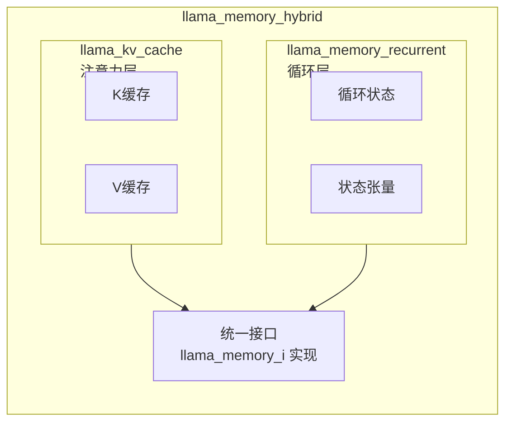
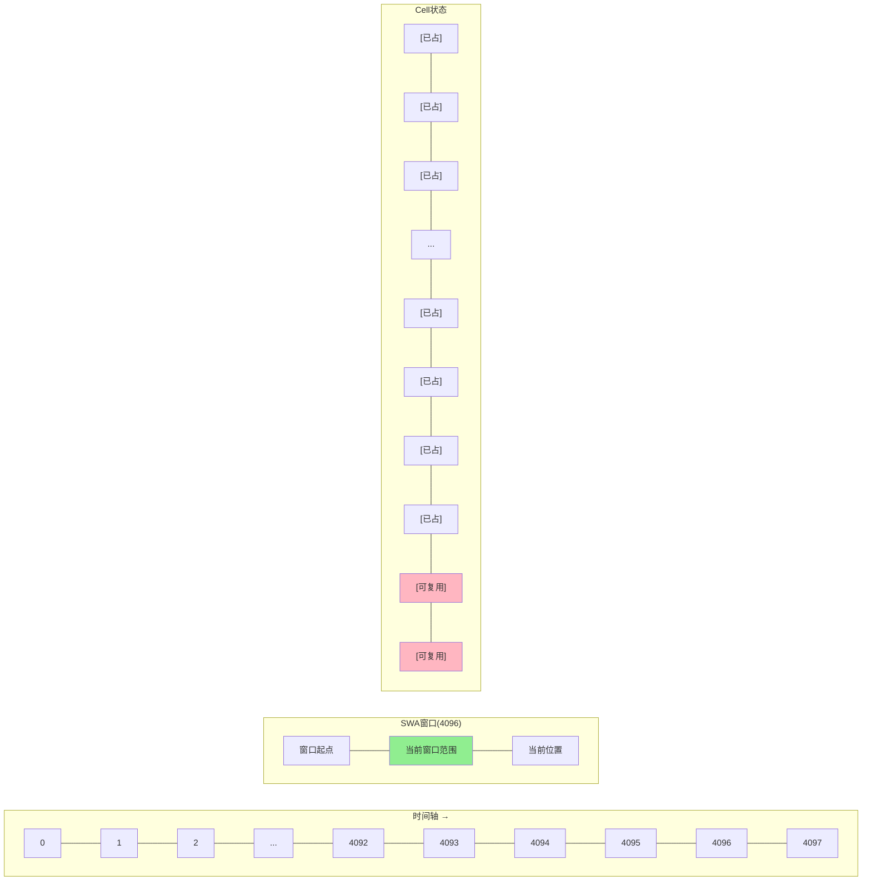
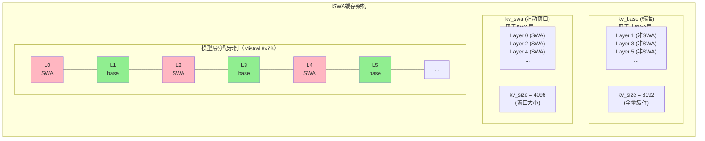

# 第12章 高级缓存策略 —— 长文本与多会话的"智慧管家"

在支持长文本和多会话的场景中，简单的KV缓存往往面临内存不足的挑战。llama.cpp提供了SWA（滑动窗口注意力）、ISWA（交错SWA）和多序列管理等高级缓存策略。本章将深入解析这些技术。

## 学习目标

1. 理解滑动窗口注意力（SWA）的实现原理
2. 掌握多序列缓存管理（Multi-Sequence）
3. 了解ISWA（Interleaved SWA）缓存架构
4. 掌握长文本处理的缓存优化技巧

## 生活类比：图书馆的"智能书架系统"

想象 llama.cpp 的 KV 缓存是一位管理巨型图书馆的智慧管家。普通的缓存就像传统书架，每本书（token）按顺序摆放，空间满了就从头开始覆盖——适合短文本，但长文本会丢失前文。而 SWA（滑动窗口注意力）则像是热门书籍专区，只保留最近 N 本书（如 4096 本），超出窗口的旧书自动移入"冷存储"，非常适合无限长文本生成。

当多位读者同时来访时，多序列缓存就像多用户借阅系统：每个读者（序列）拥有自己的借阅区域，可以独立添加、删除、复制书籍，支持多对话并行处理。ISWA 则是一种混合书架布局，它将普通书籍区和热门书籍区结合起来，让不同层使用不同的策略——有些层保留全量历史，有些层只保留滑动窗口，从而在长文本能力和上下文理解之间取得平衡。

就像图书馆需要针对不同读者和书籍类型优化布局，KV 缓存需要根据模型架构和使用场景选择最佳策略。面对显存有限但需求多样的现实，这些高级缓存策略让我们可以在相同的硬件上跑更长的文本、服务更多的用户。

---

## 12.0 扩展内存类型

除了标准KV缓存和iSWA缓存，llama.cpp还支持**循环模型内存**和**混合内存**，用于处理RWKV、Mamba等非Transformer架构以及混合架构模型（如Jamba）。这些扩展内存类型通过统一的抽象接口，为不同架构的模型提供高效的内存管理方案。

### 12.0.1 llama_memory_recurrent - 循环模型内存

**源码位置**：`src/llama-memory-recurrent.h`（第15-125行）

循环模型（如Mamba、RWKV）不使用标准的KV缓存，而是维护一个**循环状态**（recurrent state）。`llama_memory_recurrent`为这类模型提供内存管理。

**核心结构**：

```cpp
class llama_memory_recurrent : public llama_memory_i {
public:
    // 循环状态单元
    struct mem_cell {
        llama_pos pos  = -1;      // 位置
        int32_t   src  = -1;      // 状态复制源
        int32_t   src0 = -1;      // 输入阶段复制源
        int32_t   tail = -1;      // 尾指针
        std::set<llama_seq_id> seq_id;  // 所属序列
    };

    std::vector<mem_cell> cells;  // 状态单元数组
    std::vector<ggml_tensor *> r_l;  // 每层循环张量
    std::vector<ggml_tensor *> s_l;  // 每层状态张量

    uint32_t head = 0;  // 批次放置位置
    uint32_t size = 0;  // 总单元数
    uint32_t used = 0;  // 已使用单元数
};
```

**与KV缓存的区别**：

| 特性 | KV缓存 | 循环状态 |
|------|--------|----------|
| 存储内容 | K/V向量 | 循环隐藏状态 |
| 计算方式 | 点积注意力 | 状态转换函数 |
| 内存复杂度 | O(n_layer × n_ctx × d_head) | O(n_layer × d_state) |
| 适用模型 | Transformer | Mamba、RWKV |

**槽位查找机制**：

循环内存使用简化的槽位查找，因为循环模型通常只需要维护固定大小的状态：

```cpp
bool llama_memory_recurrent::find_slot(const llama_ubatch & ubatch) {
    // 循环内存通常按顺序使用
    // 只需要确保有足够的连续空间
    // ...
}
```

### 12.0.2 llama_memory_hybrid - 混合内存

**源码位置**：`src/llama-memory-hybrid.h`（第19-90行）

混合内存用于**混合架构模型**（如Jamba），其中部分层使用标准注意力，部分层使用循环机制。

**设计思想**：



**关键实现**：

```cpp
class llama_memory_hybrid : public llama_memory_i {
public:
    llama_memory_hybrid(
        const llama_model & model,
        /* 注意力参数 */
        ggml_type type_k, ggml_type type_v,
        bool v_trans, uint32_t kv_size,
        /* 循环参数 */
        ggml_type type_r, ggml_type type_s,
        uint32_t rs_size,
        /* 层过滤器 */
        const layer_filter_cb & filter_attn = nullptr,
        const layer_filter_cb & filter_recr = nullptr);

    // 获取子内存
    llama_kv_cache * get_mem_attn() const;
    llama_memory_recurrent * get_mem_recr() const;

private:
    const std::unique_ptr<llama_kv_cache> mem_attn;      // 注意力内存
    const std::unique_ptr<llama_memory_recurrent> mem_recr; // 循环内存
};
```

**层过滤机制**：

```cpp
// 定义哪些层使用注意力，哪些层使用循环
auto filter_attn = [](int32_t il) { 
    return il % 2 == 0;  // 偶数层用注意力
};
auto filter_recr = [](int32_t il) { 
    return il % 2 == 1;  // 奇数层用循环
};
```

**操作分发**：

混合内存将操作分发给对应的子内存：

```cpp
void llama_memory_hybrid::seq_cp(llama_seq_id src, llama_seq_id dst,
                                  llama_pos p0, llama_pos p1) {
    // 对注意力内存执行复制
    mem_attn->seq_cp(src, dst, p0, p1);
    // 对循环内存执行复制
    mem_recr->seq_cp(src, dst, p0, p1);
}
```

### 12.0.3 llama_memory_hybrid_iswa - 混合+iSWA内存

**源码位置**：`src/llama-memory-hybrid-iswa.h`（第19-90行）

这是混合内存的扩展版本，支持**交错滑动窗口注意力（iSWA）**。适用于需要混合架构同时又有长文本需求的场景。

**与 llama_memory_hybrid 的区别**：

```cpp
class llama_memory_hybrid_iswa : public llama_memory_i {
    // 使用 llama_kv_cache_iswa 替代 llama_kv_cache
    const std::unique_ptr<llama_kv_cache_iswa> mem_attn;
    const std::unique_ptr<llama_memory_recurrent> mem_recr;
};
```

**使用场景**：

- **Jamba + 长文本**：Jamba本身混合了Transformer和Mamba层，iSWA变体让Transformer层支持滑动窗口
- **效率与长度兼得**：循环层提供高效长程依赖，iSWA层提供局部精确注意力

### 12.0.4 内存类型选择指南

**模型架构与内存类型对应表**：

| 模型架构 | 内存类型 | 说明 |
|----------|----------|------|
| Llama/Qwen/Gemma | `llama_kv_cache` | 标准Transformer |
| Mistral | `llama_kv_cache` (SWA) | SWA支持 |
| RWKV | `llama_memory_recurrent` | 纯循环模型 |
| Mamba | `llama_memory_recurrent` | 状态空间模型 |
| Jamba | `llama_memory_hybrid` | 混合架构 |
| 长文本Jamba | `llama_memory_hybrid_iswa` | 混合+iSWA |

**内存初始化流程**：

```cpp
// llama_context.cpp
llama_memory_ptr llama_context::create_memory(const llama_model & model) {
    if (model.has_recurrent_layers() && model.has_attention_layers()) {
        if (model.has_swa_layers()) {
            return std::make_unique<llama_memory_hybrid_iswa>(model, ...);
        } else {
            return std::make_unique<llama_memory_hybrid>(model, ...);
        }
    } else if (model.has_recurrent_layers()) {
        return std::make_unique<llama_memory_recurrent>(model, ...);
    } else {
        // 标准Transformer
        if (model.has_swa()) {
            return std::make_unique<llama_kv_cache_iswa>(model, ...);
        } else {
            return std::make_unique<llama_kv_cache>(model, ...);
        }
    }
}
```

### 12.0.5 设计中的取舍

**为什么需要多种内存类型？**

| 内存类型 | 适用场景 | 复杂度 | 内存占用 |
|---------|---------|--------|----------|
| KV缓存 | Transformer | 高 | 与序列长度成正比 |
| 循环状态 | RWKV/Mamba | 中 | 固定大小 |
| 混合 | Jamba等 | 很高 | 两者之和 |

**设计原则**：
1. **根据架构自动选择**：模型加载时自动检测并创建合适的内存类型
2. **统一接口操作**：上层代码通过`llama_memory_i`统一操作，无需关心具体实现
3. **资源复用**：尽可能共享计算图和其他资源，避免重复分配

---

## 12.1 滑动窗口注意力（SWA）

### 12.1.1 SWA设计动机

**问题背景**：
- 标准Attention的复杂度是O(n²)，长文本时KV缓存爆炸
- 但远距离token的注意力权重通常很小
- 能否只保留最近的K个token的KV？

**SWA解决方案**：
- 只缓存最近`n_swa`个token的KV
- 注意力计算时只attend到窗口内的token
- 内存复杂度从O(n)降为O(n_swa)

### 12.1.2 SWA类型定义

**源码位置**：`src/llama-hparams.h`

```cpp
enum llama_swa_type {
    LLAMA_SWA_TYPE_NONE = 0,      // 不使用SWA
    LLAMA_SWA_TYPE_NORMAL = 1,    // 标准SWA（Mistral风格）
};

// SWA掩码判断
static bool is_masked_swa(
        uint32_t       n_swa,      // 窗口大小
        llama_swa_type swa_type,   // SWA类型
        llama_pos      p0,         // KV位置
        llama_pos      p1) {       // 当前查询位置
    if (swa_type == LLAMA_SWA_TYPE_NONE || n_swa == 0) {
        return false;  // 不掩码
    }
    // 如果KV位置距离当前位置超过窗口大小，掩码掉
    return p1 - p0 > (llama_pos) n_swa;
}
```

这段代码定义了SWA类型枚举和SWA掩码判断函数。函数检查当前查询位置p1与KV位置p0之间的距离是否超过窗口大小n_swa，如果超出则返回true表示需要掩码掉该KV，实现滑动窗口注意力机制。

### 12.1.3 SWA在KV缓存中的应用

**源码位置**：`src/llama-kv-cache.cpp`（第960-968行）

```cpp
// 在find_slot中判断cell是否可用
if (!can_use && cells.seq_count(idx) == 1) {
    const llama_pos pos_cell = cells.pos_get(idx);
    const llama_seq_id seq_id_cell = cells.seq_get(idx);

    // SWA掩码：如果cell位置超出窗口范围，可以复用
    if (llama_hparams::is_masked_swa(n_swa, swa_type, 
                                     pos_cell, 
                                     cells.seq_pos_max(seq_id_cell) + 1)) {
        can_use = true;  // 这个cell虽然被占用，但SWA会掩码它，可以覆盖
    }
}
```

这段代码展示了SWA在槽位查找中的应用。当cell已被占用但只属于单个序列时，检查该cell的位置是否超出SWA窗口范围。如果是，则允许复用该cell，因为SWA注意力不会访问窗口外的KV，从而实现缓存循环复用。

**SWA缓存复用图解**：



当生成第4097个token时：
- 位置0的KV已经被掩码（超出窗口）
- 可以安全地覆盖位置0的cell
- 实现循环复用，支持无限长文本

**SWA掩码效果**：

| KQ Mask矩阵（n_swa=4） | KV位置 | | | | | | | |
|-----------------------|--------|---|---|---|---|---|---|---|---|
| Query位置 | 0 | 1 | 2 | 3 | 4 | 5 | 6 | 7 |
| 0 | 0 | -inf | -inf | -inf | -inf | -inf | -inf | -inf | 只能attend到自己 |
| 1 | 0 | 0 | -inf | -inf | -inf | -inf | -inf | -inf | 只能attend到前2个 |
| 2 | 0 | 0 | 0 | -inf | -inf | -inf | -inf | -inf | 只能attend到前3个 |
| 3 | 0 | 0 | 0 | 0 | -inf | -inf | -inf | -inf | 窗口满，attend到4个 |
| 4 | -inf | 0 | 0 | 0 | 0 | -inf | -inf | -inf | 位置0被掩码，滑动窗口 |
| 5 | -inf | -inf | 0 | 0 | 0 | 0 | -inf | -inf | |
| 6 | -inf | -inf | -inf | 0 | 0 | 0 | 0 | -inf | |
| 7 | -inf | -inf | -inf | -inf | 0 | 0 | 0 | 0 | |

---

## 12.2 ISWA（交错SWA）缓存架构

### 12.2.1 为什么需要ISWA

**Mistral等模型的设计**：
- 部分层使用SWA（如偶数层）
- 部分层不使用SWA（如奇数层）
- 兼顾长文本能力和上下文理解

**实现挑战**：
- 需要维护两个独立的KV缓存
- 需要协调两个缓存的更新
- 需要统一对外接口

### 12.2.2 ISWA类设计

**源码位置**：`src/llama-kv-cache-iswa.h`

```cpp
class llama_kv_cache_iswa : public llama_memory_i {
public:
    llama_kv_cache_iswa(
        const llama_model & model,
        ggml_type   type_k,
        ggml_type   type_v,
        bool   v_trans,
        bool   offload,
        bool   swa_full,      // SWA层是否使用全量缓存
        bool   unified,       // 统一流模式
        uint32_t   kv_size,
        uint32_t   n_seq_max,
        uint32_t   n_ubatch,
        uint32_t   n_pad,
        const layer_filter_cb & filter,
        const  layer_reuse_cb & reuse);

    // 获取底层缓存实例
    llama_kv_cache * get_base() const;  // 非SWA层缓存
    llama_kv_cache * get_swa () const;  // SWA层缓存

private:
    const bool unified;
    std::unique_ptr<llama_kv_cache> kv_base;  // 标准缓存
    std::unique_ptr<llama_kv_cache> kv_swa;   // SWA缓存
};

这段代码定义了ISWA缓存类，继承自llama_memory_i接口。ISWA维护两个独立的KV缓存实例：kv_base用于非SWA层（全量缓存），kv_swa用于SWA层（滑动窗口缓存），通过层过滤回调决定每层使用哪个缓存。

### 12.2.3 ISWA架构图解



---

## 12.3 多序列缓存管理

### 12.3.1 多序列场景

**使用场景**：
1. **批处理推理**：同时处理多个独立对话
2. **束搜索（Beam Search）**：维护多个候选序列
3. **对话分叉**：从某点创建多个分支继续生成

### 12.3.2 流（Stream）概念

**源码位置**：`src/llama-kv-cache.h`（第229-261行）

```cpp
class llama_kv_cache {
    // 序列到流的映射
    std::vector<uint32_t> seq_to_stream;

    // 每流的cell数组
    std::vector<llama_kv_cells> v_cells;

    // 每流的头指针（循环缓冲区用）
    std::vector<uint32_t> v_heads;

    // 流数量
    const uint32_t n_stream;
};

这段代码展示了KV缓存中的流概念相关成员。seq_to_stream映射序列ID到流索引；v_cells是每个流的cell数组；v_heads是每个流的头指针用于循环缓冲区；n_stream表示流数量，1表示统一流模式，大于1表示多流模式。

**流模式对比**：

| 模式 | n_stream | 特点 | 适用场景 |
|-----|---------|------|---------|
| 统一流 | 1 | 所有序列共享cell数组 | 序列数少，需要共享前缀 |
| 多流 | n_seq_max | 每序列独立cell数组 | 序列数多，需要完全隔离 |

### 12.3.3 多序列处理图解

**批次输入（6个token，3个序列）**：

| token | T0 | T1 | T2 | T3 | T4 | T5 |
|-------|---|---|---|---|---|---|
| seq_id | 0 | 0 | 1 | 1 | 2 | 2 |
| pos | 10 | 11 | 5 | 6 | 20 | 21 |

**多流模式处理**：
- Stream 0: [T0] [T1] → 写入cells[0]的位置10,11
- Stream 1: [T2] [T3] → 写入cells[1]的位置5,6
- Stream 2: [T4] [T5] → 写入cells[2]的位置20,21

**统一流模式处理**：
- 所有token写入同一个cell数组，通过seq_id区分归属
- Cell 10: [T0], seq={0}
- Cell 11: [T1], seq={0}
- Cell 5: [T2], seq={1}
- ...

---

## 12.4 长文本优化技巧

### 12.4.1 K-Shift（位置偏移）

**问题**：当KV缓存满时，新token无处存放。

**解决方案**：
- 删除最旧的token（seq_rm）
- 将所有剩余token的位置减去偏移量
- 应用K-Shift更新RoPE编码

### 12.4.2 内存与质量的权衡

| 配置 | 内存占用 | 长文本能力 | 质量 |
|-----|---------|-----------|------|
| F16全量 | 100% | 受限于显存 | 最佳 |
| Q8_0全量 | 50% | 受限于显存 | 优秀 |
| Q4_0全量 | 25% | 受限于显存 | 良好 |
| SWA (4096) | 与长度无关 | 无限 | 良好 |
| ISWA | 中等 | 很长 | 优秀 |

### 12.4.3 缓存压缩策略

**策略1：动态SWA**
- 根据序列长度自动启用SWA
- 短文本用全量缓存，长文本用窗口

**策略2：层共享**
- 相邻层共享KV缓存
- 减少内存占用，轻微质量损失

**策略3：量化缓存**
```cpp
// 使用Q8_0或Q4_0量化KV缓存
llama_kv_cache kv_cache(
    model,
    GGML_TYPE_Q8_0,  // K缓存8位量化
    GGML_TYPE_Q4_0,  // V缓存4位量化
    ...
);
```

这段代码展示了如何使用量化类型创建KV缓存，以减少内存占用。通过将K缓存设置为Q8_0（8位量化）、V缓存设置为Q4_0（4位量化），可以在保持较好质量的同时显著降低KV缓存的内存占用。

---

## 12.5 设计中的取舍

### 为什么ISWA比纯SWA更好？

**纯SWA**：
- 优点：内存固定，支持无限长文本
- 缺点：所有层都受限，可能丢失重要上下文

**ISWA**：
- 优点：部分层保留全量上下文，部分层使用窗口
- 缺点：实现复杂，需要维护两个缓存

**llama.cpp的选择**：
- 支持纯SWA、纯标准、ISWA三种模式
- 通过模型配置自动选择最优策略

### 统一流 vs 多流

**统一流**：
- 适合：序列数少，需要共享系统提示
- 缺点：序列数多时cell碎片化严重

**多流**：
- 适合：序列数多，需要完全隔离
- 缺点：内存预分配，可能浪费

---

## 12.6 动手练习

### 练习1：计算ISWA内存占用

给定配置：
- n_layer = 32（其中16层SWA，16层非SWA）
- kv_size = 8192
- n_swa = 4096
- type_k = Q8_0, type_v = Q8_0
- n_embd_k_gqa = n_embd_v_gqa = 1024

计算：
1. 纯标准缓存的总内存
2. 纯SWA缓存的总内存
3. ISWA缓存的总内存


### 练习2：设计缓存策略

假设你需要部署一个支持100K上下文的应用，但GPU只有24GB显存，设计一个合理的缓存策略。

---

## 12.7 本章小结

本章介绍了高级缓存策略。SWA（滑动窗口注意力）使用固定内存支持无限长文本生成。ISWA（交错SWA）让部分层使用窗口注意力、部分层使用全量注意力，兼顾效率和质量。多流模式为每个序列分配独立的cell数组，实现完全隔离。统一流模式让所有序列共享cell数组，支持共享前缀以节省内存。K-Shift实现位置偏移功能，支持在缓存内移动token位置。seq_rm/cp提供序列操作能力，支持删除、复制和分叉等操作。

本章我们一起学习了以下概念：

| 概念 | 解释 |
|------|------|
| SWA | 滑动窗口注意力，只缓存最近 n_swa 个 token，用固定内存支持无限长文本 |
| ISWA | 交错 SWA，部分层用窗口注意力、部分层用全量注意力，兼顾效率和质量 |
| 多流模式 | 每个序列分配独立的 cell 数组，实现完全隔离 |
| 统一流模式 | 所有序列共享 cell 数组，通过 seq_id 区分归属 |
| K-Shift | 位置偏移技术，在缓存满时整体平移 token 位置以腾出空间 |
| 缓存量化 | 将 KV 缓存以 Q8_0/Q4_0 等量化格式存储，减少内存占用 |

**下一章预告**：

下一章中，我们将学习分词器架构，理解文本如何转换为模型可处理的 token 序列。
