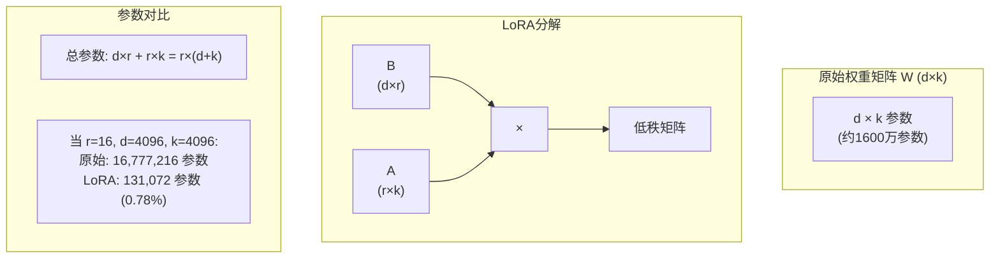
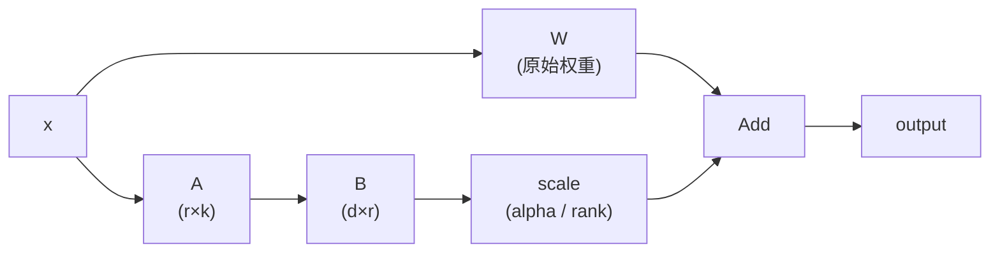
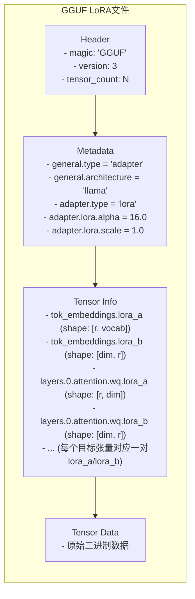
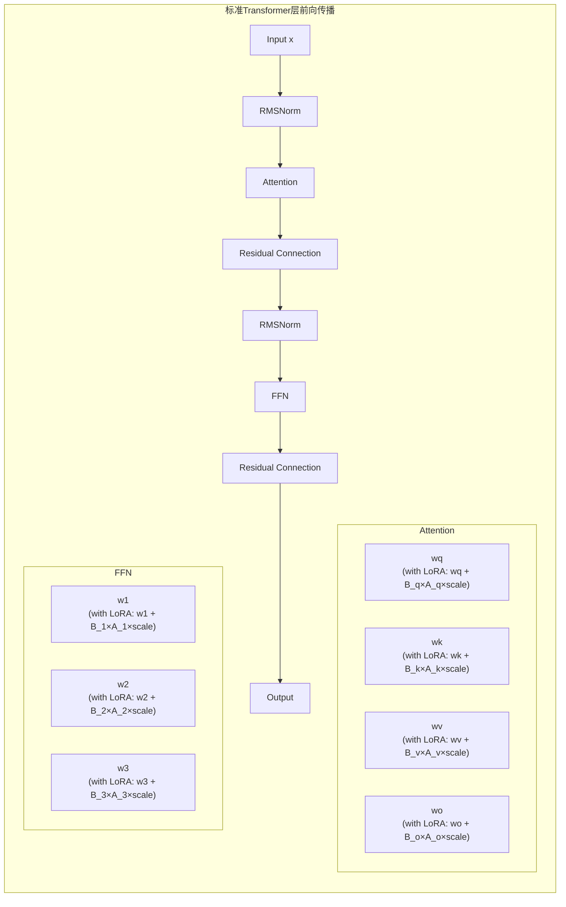

# 第19章 LoRA适配器支持 —— 模型微调的"即插即用"方案

大语言模型的全参数微调需要巨大的计算资源和存储空间。一个70B参数的模型，全参数微调可能需要数百GB显存和数周训练时间。但很多时候，我们只需要让模型学会特定的说话风格、掌握某个小众领域知识，或者适应特定的输出格式。LoRA（Low-Rank Adaptation，低秩适应）技术正是解决这一问题的利器——它只训练不到1%的参数，却能实现接近全参数微调的效果。llama.cpp对LoRA的完整支持，让这种高效的模型定制变得轻而易举。

## 学习目标

1. 理解LoRA（低秩适应）技术的核心原理
2. 掌握llama.cpp中LoRA适配器的加载与合并机制
3. 学会使用llama_adapter相关API进行推理时适配器切换
4. 了解GGUF LoRA格式与HuggingFace格式的转换
5. 能够实现多适配器组合与动态权重调整

## 生活类比：乐高积木与插件系统

想象你有一个基础乐高城堡，它代表了预训练好的基础模型。全参数微调相当于把整座城堡拆了重建——虽然理论上可以建成任何你想要的样子，但这个过程费时费力，而且原来的城堡也不复存在了。你失去了一个经过精心设计和大量测试的稳定基础。

LoRA适配器则完全不同，它像是给城堡设计的可拆卸扩展模块。你想加一座塔楼？装上塔楼扩展包就行。想要一座吊桥？挂上吊桥扩展包即可。更重要的是，这些扩展随时可以拆下来，城堡本身完好无损。多适配器组合更是锦上添花——你可以同时安装塔楼扩展包、吊桥扩展包和护城河扩展包，打造出一座独一无二的定制城堡。动态切换让你能在不同场景间自如切换：上午用骑士主题装饰，下午换成龙主题，晚上切换到中世纪市集主题。

GGUF格式则像是一套标准化的接口规格，它确保任何厂商生产的扩展包都能完美兼容你的城堡。无论扩展包来自哪个团队、使用什么工具制作，只要遵循GGUF标准，就能即插即用。LoRA的核心优势在于效率：只训练约1%的参数，却能实现接近90%的全参数微调效果。就像只换家具而不改房子结构，既快速完成了翻新，又完整保留了房子的所有原有功能。

## 源码地图

```
src/llama-adapter.h            # 适配器头文件
  ├── llama_adapter_cvec               # 控制向量适配器
  ├── llama_adapter_lora_weight        # LoRA权重结构
  ├── llama_adapter_lora               # LoRA适配器主体
  └── llama_adapter_loras              # 适配器集合

src/llama-adapter.cpp          # 适配器实现（约500行）
  ├── llama_adapter_lora_init()        # 初始化LoRA适配器
  ├── llama_adapter_lora_weight::get_scale()  # 计算缩放因子
  └── llama_adapter_cvec::apply()      # 应用控制向量

convert_lora_to_gguf.py        # LoRA转换工具（约500行）
  ├── LoraTorchTensor                  # LoRA张量封装
  ├── get_base_tensor_name()           # 获取基础张量名
  └── main()                           # 转换主流程

include/llama.h                # C API声明
  ├── llama_adapter_lora_init()        # 初始化适配器
  ├── llama_adapter_lora_free()        # 释放适配器
  ├── llama_set_adapter_lora()         # 设置适配器
  └── llama_rm_adapter_lora()          # 移除适配器
```

## 19.1 LoRA原理回顾

### 19.1.1 低秩适应的数学原理

**原始权重更新**：
```
W_new = W_original + ΔW

传统微调：ΔW 是完整矩阵，参数量 = d × k
```

**LoRA分解**：
```
ΔW = B × A

其中：
- B: d × r 矩阵（输出投影）
- A: r × k 矩阵（输入投影）
- r << min(d, k) （秩，通常8-64，远小于原始维度）

参数量 = d×r + r×k = r×(d+k) << d×k
```

**图解LoRA分解**：



这种分解的直觉是：模型权重的更新往往是低秩的。与其学习完整的更新矩阵，不如学习两个小的投影矩阵，它们的乘积近似于所需的更新。

### 19.1.2 前向传播计算

**源码位置**：`src/llama-adapter.h`（第48-61行）

```cpp
struct llama_adapter_lora_weight {
    ggml_tensor * a = nullptr;  // lora_A (r × k)
    ggml_tensor * b = nullptr;  // lora_B (d × r)
    
    // 计算实际缩放因子
    float get_scale(float alpha, float adapter_scale) const {
        const float rank = (float) b->ne[0];  // r
        const float scale = alpha ? adapter_scale * alpha / rank : adapter_scale;
        return scale;
    }
};
```

**计算流程**：
```
输入 x
    ↓
原始输出: h = W × x
    ↓
LoRA分支: 
  h_lora = B × A × x × scale
         = B × (A × x) × scale
    ↓
合并输出: y = h + h_lora
         = W×x + B×A×x×scale
         = (W + B×A×scale) × x
```

**图解计算图**：



**为什么有效？**

1. **参数高效**：只训练B和A，冻结W，参数量减少99%
2. **计算高效**：A×x的计算量远小于W×x
3. **效果接近**：在多数任务上接近全参数微调效果

## 19.2 适配器加载机制

### 19.2.1 GGUF LoRA文件解析

**源码位置**：`src/llama-adapter.cpp`（第149-240行）

```cpp
static void llama_adapter_lora_init_impl(
        llama_model & model, 
        const char * path_lora, 
        llama_adapter_lora & adapter) {
    
    // 1. 加载GGUF文件
    gguf_context_ptr ctx_gguf { gguf_init_from_file(path_lora, meta_gguf_params) };
    ggml_context_ptr ctx { ctx_init };
    
    // 2. 验证元数据
    {
        auto general_type = get_kv_str(llm_kv(LLM_KV_GENERAL_TYPE));
        if (general_type != "adapter") {
            throw std::runtime_error("expect general.type to be 'adapter'");
        }
        
        auto adapter_type = get_kv_str(llm_kv(LLM_KV_ADAPTER_TYPE));
        if (adapter_type != "lora") {
            throw std::runtime_error("expect adapter.type to be 'lora'");
        }
        
        // 检查架构匹配
        auto general_arch = llm_arch_from_string(general_arch_str);
        if (general_arch != model.arch) {
            throw std::runtime_error(
                "model arch and LoRA arch mismatch: " + 
                llm_arch_name(model.arch) + " vs " + 
                llm_arch_name(general_arch)
            );
        }
        
        adapter.alpha = get_kv_f32(llm_kv(LLM_KV_ADAPTER_LORA_ALPHA));
    }
    
    // 3. 解析张量...
}
```

**GGUF LoRA文件结构**：



### 19.2.2 权重映射与配对

**源码位置**：`src/llama-adapter.cpp`（第265-295行）

```cpp
// 将lora_a和lora_b配对
std::map<std::string, llama_adapter_lora_weight> ab_map;

for (ggml_tensor * cur = ggml_get_first_tensor(ctx.get()); 
     cur; 
     cur = ggml_get_next_tensor(ctx.get(), cur)) {
    
    std::string name(cur->name);
    
    if (str_endswith(name, ".lora_a")) {
        replace_all(name, ".lora_a", "");
        if (ab_map.find(name) == ab_map.end()) {
            ab_map[name] = llama_adapter_lora_weight(cur, nullptr);
        } else {
            ab_map[name].a = cur;
        }
    } else if (str_endswith(name, ".lora_b")) {
        replace_all(name, ".lora_b", "");
        if (ab_map.find(name) == ab_map.end()) {
            ab_map[name] = llama_adapter_lora_weight(nullptr, cur);
        } else {
            ab_map[name].b = cur;
        }
    }
}
```

**张量命名映射**：
```
HuggingFace LoRA命名 → GGUF命名

base_model.model.model.embed_tokens.lora_A.weight
    → tok_embeddings.lora_a

base_model.model.model.layers.0.self_attn.q_proj.lora_A.weight
    → layers.0.attention.wq.lora_a

base_model.model.model.layers.0.mlp.gate_proj.lora_A.weight
    → layers.0.feed_forward.w1.lora_a

base_model.model.model.layers.0.mlp.up_proj.lora_A.weight
    → layers.0.feed_forward.w3.lora_a

base_model.model.model.layers.0.mlp.down_proj.lora_A.weight
    → layers.0.feed_forward.w2.lora_a
```

### 19.2.3 内存分配与加载

**源码位置**：`src/llama-adapter.cpp`（第319-412行）

```cpp
// 为每个目标张量创建对应的LoRA张量
for (auto & it : ab_map) {
    const std::string & name = it.first;
    llama_adapter_lora_weight & w = it.second;
    
    // 查找对应的基础模型张量
    const auto * model_tensor = model.get_tensor(name.c_str());
    if (!model_tensor) {
        LLAMA_LOG_WARN("%s: LoRA tensor '%s' does not exist in base model\n", __func__, name.c_str());
        continue;  // 跳过不匹配的张量
    }
    
    // 获取buffer类型（CPU/GPU）
    auto * buft = ggml_backend_buffer_get_type(model_tensor->buffer);
    
    // 创建张量副本
    ggml_context * dev_ctx = ctx_for_buft(buft);
    ggml_tensor * tensor_a = ggml_dup_tensor(dev_ctx, w.a);
    ggml_tensor * tensor_b = ggml_dup_tensor(dev_ctx, w.b);
    
    // 验证形状兼容性
    if (model_tensor->ne[0] != w.a->ne[0] || model_tensor->ne[1] != w.b->ne[1]) {
        throw std::runtime_error("tensor shape mismatch");
    }
    if (w.a->ne[1] != w.b->ne[0]) {
        throw std::runtime_error("lora_a tensor is not transposed");
    }
    
    adapter.ab_map[name] = llama_adapter_lora_weight(tensor_a, tensor_b);
}

// 分配缓冲区并加载数据
for (auto & it : ctx_map) {
    ggml_backend_buffer_t buf = ggml_backend_alloc_ctx_tensors_from_buft(
        it.second.get(), it.first);
    // 从文件读取数据到buffer...
}

// 注册适配器到模型
model.loras.insert(&adapter);
```

## 19.3 推理时适配器应用

### 19.3.1 适配器查询接口

**源码位置**：`src/llama-adapter.cpp`（第138-147行）

```cpp
llama_adapter_lora_weight * llama_adapter_lora::get_weight(ggml_tensor * w) {
    const std::string name(w->name);
    
    const auto pos = ab_map.find(name);
    if (pos != ab_map.end()) {
        return &pos->second;
    }
    
    return nullptr;  // 该张量没有LoRA适配
}
```

### 19.3.2 计算图构建时的适配器集成

**图解适配器集成到Transformer层**：



在llama.cpp的计算图构建中，当遇到有LoRA适配的权重时，会插入LoRA分支的计算节点。

### 19.3.3 多适配器管理

**源码位置**：`src/llama-adapter.h`（第90-91行）

```cpp
using llama_adapter_loras = std::unordered_map<llama_adapter_lora *, float>;
// key: 适配器指针, value: 缩放系数
```

**多适配器组合示例**：
```cpp
// 加载两个适配器
llama_adapter_lora * lora_coding = llama_adapter_lora_init(
    model, "coding-lora.gguf"
);
llama_adapter_lora * lora_english = llama_adapter_lora_init(
    model, "english-lora.gguf"
);

// 设置适配器权重
llama_set_adapter_lora(ctx, lora_coding, 0.8f);   // 80% 代码能力
llama_set_adapter_lora(ctx, lora_english, 0.6f);  // 60% 英文优化

// 推理时两个适配器同时生效
// 效果 = base + 0.8 × ΔW_coding + 0.6 × ΔW_english
```

**图解多适配器组合**：
```
单适配器:
Output = W_base × x + scale × B × A × x

多适配器:
Output = W_base × x 
       + scale_1 × B_1 × A_1 × x
       + scale_2 × B_2 × A_2 × x
       + ...
       
等价于:
Output = (W_base + Σ(scale_i × B_i × A_i)) × x
```

多适配器组合的应用场景：
1. **风格融合**：正式风格 + 友好风格 = 专业但亲切的回复
2. **领域组合**：医学知识 + 法律术语 = 医疗法务咨询
3. **能力叠加**：代码能力 + 数学能力 = 算法实现

## 19.4 适配器导出工具

### 19.4.1 转换流程概览

**源码位置**：`convert_lora_to_gguf.py`（第301-503行）

```python
def main():
    # 1. 加载LoRA权重
    if input_model.suffix == '.safetensors':
        from safetensors.torch import load_file
        lora_model = load_file(input_model, device="cpu")
    else:
        lora_model = torch.load(input_model, map_location="cpu")
    
    # 2. 加载基础模型配置
    hparams = ModelBase.load_hparams(dir_base_model)
    
    # 3. 创建LoraModel类
    class LoraModel(model_class):
        def get_tensors(self):
            # 配对lora_A和lora_B
            tensor_map = {}
            for name, tensor in lora_model.items():
                base_name = get_base_tensor_name(name)
                is_lora_a = ".lora_A.weight" in name
                is_lora_b = ".lora_B.weight" in name
                
                if base_name in tensor_map:
                    if is_lora_a:
                        tensor_map[base_name].A = tensor
                    else:
                        tensor_map[base_name].B = tensor
                else:
                    if is_lora_a:
                        tensor_map[base_name] = PartialLoraTensor(A=tensor)
                    else:
                        tensor_map[base_name] = PartialLoraTensor(B=tensor)
            
            # 返回LoraTorchTensor
            for name, tensor in tensor_map.items():
                yield (name, LoraTorchTensor(tensor.A, tensor.B))
    
    # 4. 导出GGUF
    model_instance = LoraModel(...)
    model_instance.write()
```

### 19.4.2 LoraTorchTensor封装

**源码位置**：`convert_lora_to_gguf.py`（第40-235行）

```python
class LoraTorchTensor:
    """封装LoRA张量对(A, B)，支持切片、reshape等操作"""
    
    def __init__(self, A: Tensor, B: Tensor):
        assert A.shape[-2] == B.shape[-1]  # 验证秩匹配
        self._lora_A = A
        self._lora_B = B
        self._rank = B.shape[-1]
    
    @property
    def shape(self) -> tuple[int, ...]:
        # 最终形状由B的前几维和A的最后一维决定
        return (*self._lora_B.shape[:-1], self._lora_A.shape[-1])
    
    def reshape(self, *shape: int) -> LoraTorchTensor:
        # 对A和B分别reshape
        orig_shape = self.shape
        new_shape = tuple(shape)
        
        # 构造新的shape
        shape_A = (*(1 for _ in new_shape[:-2]), self._rank, orig_shape[-1])
        shape_B = (*new_shape[:-1], self._rank)
        
        return LoraTorchTensor(
            self._lora_A.reshape(shape_A),
            self._lora_B.reshape(shape_B)
        )
    
    def permute(self, *dims: int) -> LoraTorchTensor:
        # 处理维度置换
        if dims[-1] == -1 or dims[-1] == len(dims) - 1:
            # 最后一维来自A
            return LoraTorchTensor(self._lora_A, self._lora_B.permute(*dims))
        # ...
    
    def get_lora_A_B(self) -> tuple[Tensor, Tensor]:
        return (self._lora_A, self._lora_B)
```

### 19.4.3 命令行使用

```bash
# 基本转换
python convert_lora_to_gguf.py /path/to/lora_adapter \
    --base /path/to/base_model \
    --outfile output.gguf

# 指定输出格式
python convert_lora_to_gguf.py /path/to/lora_adapter \
    --outtype f16 \
    --outfile output-f16.gguf

# 从HuggingFace加载基础模型配置
python convert_lora_to_gguf.py /path/to/lora_adapter \
    --base-model-id meta-llama/Llama-2-7b-hf \
    --outfile output.gguf

# 批量转换
for lora in ./loras/*; do
    python convert_lora_to_gguf.py "$lora" \
        --base ./base_model \
        --outfile "./gguf/$(basename $lora).gguf"
done
```

## 19.5 激活型LoRA（aLoRA）

**源码位置**：`src/llama-adapter.h`（第78行）和`src/llama-adapter.cpp`（第221-238行）

```cpp
struct llama_adapter_lora {
    // 激活型LoRA：通过特定token序列触发
    std::vector<llama_token> alora_invocation_tokens;
};

// 解析aLoRA调用序列
const auto & key = llm_kv(LLM_KV_ADAPTER_ALORA_INVOCATION_TOKENS);
const int kid = gguf_find_key(ctx_gguf.get(), key.c_str());
if (kid >= 0) {
    const size_t seq_len = gguf_get_arr_n(ctx_gguf.get(), kid);
    const void * data = gguf_get_arr_data(ctx_gguf.get(), kid);
    adapter.alora_invocation_tokens.resize(seq_len);
    std::copy(
        (const llama_token *)data,
        (const llama_token *)data + seq_len,
        adapter.alora_invocation_tokens.begin()
    );
}
```

**aLoRA工作原理**：
```
普通LoRA: 始终生效
aLoRA: 检测到调用token后才生效

示例:
基础模型: 通用对话模型
aLoRA: 代码专家
调用token: [CODE_MODE]

对话:
用户: 你好
模型: 你好！有什么可以帮助你的吗？（基础模型）

用户: [CODE_MODE] 写一个快排
模型: ```python
def quicksort(arr):
    ...（激活代码LoRA）
```

用户: 谢谢
模型: 不客气！（回到基础模型）
```

aLoRA的应用场景：
1. **角色扮演**：通过触发词切换角色
2. **专业模式**：[EXPERT_MODE]激活专业领域知识
3. **安全模式**：[SAFE_MODE]激活内容过滤

## 19.6 设计中的取舍

### 为什么选择LoRA而不是全参数微调？

LoRA在存储和计算开销上都有显著优势。全参数微调需要存储一个完整的模型副本，占用100%的存储空间，计算开销也是100%，而且每个任务需要一个独立模型，灵活性极低。相比之下，LoRA在r=16时只需0.78%的参数，推理时计算开销仅为约105%——增加的计算几乎可以忽略不计。即使使用更高的秩（r=64），参数量也只有3.1%，而灵活性极高：多个LoRA可以任意组合，实现能力叠加。还有一种选择是直接将适配器合并到基础模型（适配器合并），这种方式虽然推理时没有额外开销（100%存储+100%计算），但完全失去了基础模型独立的优势，无法动态调整。llama.cpp选择动态LoRA加载而非合并，正是为了保留模块化和灵活性。

### 为什么选择动态加载而不是适配器合并？

llama.cpp选择了动态加载LoRA适配器而非在加载时将其合并到基础模型权重中。这样做有明显的权衡。合并适配器的优点是推理时完全没有任何额外开销——合并后的模型等同于一个普通的单模型，不需要在计算图中插入额外的LoRA分支。但合并的代价也很高：一旦合并，你就永远失去了原始的基础模型。如果之后想移除某个适配器或调整其强度，合并后的模型无能为力。

动态加载虽然会在每次推理时增加约5%-10%的计算开销（来自额外的低秩矩阵乘法），并且需要额外的显存来存储LoRA权重，但它提供了无与伦比的灵活性：你可以在运行时动态切换适配器，组合多个适配器，甚至实时调整每个适配器的缩放系数。对于需要频繁切换不同风格或能力的应用场景（如一个服务需要同时支持多种专业领域），动态加载是唯一可行的方案。

### 如何选择合适的秩（rank）？

秩（rank）是LoRA中最重要的超参数，它直接决定了适配器的参数量和学习能力。r=4-8适用于简单的风格调整任务，参数量极少（约0.2%），训练速度快，但能有效改变模型的语调和措辞。r=16-32是平衡性最好的选择，也是大多数场景的推荐值，参数占比约0.5%-1.2%，在保持高效的同时能应对绝大多数微调任务。r=64-128适用于复杂任务，如学习新的领域知识或特定格式输出，参数占比约2.5%-5%，效果最接近全参数微调。r>256时收益开始递减——继续增加秩带来的质量提升微乎其微，但参数量和训练成本却显著上升。一个实用的经验法则是：风格/格式类任务选择r=8-16，领域知识任务选择r=16-32，复杂能力任务选择r=32-64，从较小的r开始尝试并根据效果逐步调整，这比一开始就选择大r更高效。

## 19.7 动手练习

### 练习1：加载并使用LoRA适配器

```cpp
#include "llama.h"

int main() {
    // 加载基础模型
    llama_model_params model_params = llama_model_default_params();
    llama_model * model = llama_load_model("base.gguf", model_params);
    
    // 加载LoRA适配器
    llama_adapter_lora * lora = llama_adapter_lora_init(model, "lora.gguf");
    if (!lora) {
        fprintf(stderr, "Failed to load LoRA\n");
        return 1;
    }
    
    // 创建上下文
    llama_context_params ctx_params = llama_context_default_params();
    llama_context * ctx = llama_new_context_with_model(model, ctx_params);
    
    // 设置LoRA适配器（scale=1.0）
    llama_set_adapter_lora(ctx, lora, 1.0f);
    
    // 推理...
    llama_token token = llama_sampler_sample(smpl, ctx, 0);
    
    // 清理
    llama_rm_adapter_lora(ctx, lora);
    llama_adapter_lora_free(lora);
    llama_free(ctx);
    llama_free_model(model);
    
    return 0;
}
```

### 练习2：转换HuggingFace LoRA

```bash
# 下载HuggingFace LoRA
huggingface-cli download user/repo --local-dir ./lora

# 转换为GGUF
python convert_lora_to_gguf.py ./lora \
    --base-model-id meta-llama/Llama-2-7b-hf \
    --outtype f16 \
    --outfile ./lora.gguf

# 验证转换结果
./llama-cli -m base.gguf --lora lora.gguf -p "Test prompt"
```

### 练习3：多适配器插值

```cpp
// 创建风格混合效果
llama_adapter_lora * lora_formal = llama_adapter_lora_init(
    model, "formal.gguf"
);
llama_adapter_lora * lora_casual = llama_adapter_lora_init(
    model, "casual.gguf"
);

// 测试不同插值比例
for (float alpha = 0.0f; alpha <= 1.0f; alpha += 0.25f) {
    llama_clear_adapter_lora(ctx);  // 清除之前的适配器
    
    // 插值: formal × alpha + casual × (1-alpha)
    llama_set_adapter_lora(ctx, lora_formal, alpha);
    llama_set_adapter_lora(ctx, lora_casual, 1.0f - alpha);
    
    printf("\n=== Alpha = %.2f ===\n", alpha);
    // 生成文本...
}
```

## 19.8 本章小结

本章深入解析了LoRA适配器技术。LoRA采用低秩分解技术，通过 ΔW = B × A 的公式只训练约0.78%的参数。缩放因子 scale = alpha / rank 用于控制适配强度。GGUF LoRA是标准化的适配器格式，包含metadata和张量对信息。张量配对机制中，lora_a (r×k) 和 lora_b (d×r) 共同组成完整的LoRA适配器。多适配器支持可以加权组合多个适配器，实现能力叠加效果。aLoRA是一种通过特定token触发的条件适配器。

LoRA的核心优势包括：参数高效，训练成本低且存储需求小；模块化设计实现即插即用和灵活组合；不会导致基础模型遗忘，原有能力完整保留；小文件易于分发和复用。最佳实践建议：rank选择从r=16开始，根据效果进行调整；alpha设置通常等于rank或2倍rank；推理时通过scale参数微调效果强度；多适配器组合时使用scale实现平滑的能力插值。

本章我们一起学习了以下概念：

| 概念 | 解释 |
|------|------|
| LoRA（低秩适应） | 通过ΔW = B × A的低秩分解只训练约1%参数即可实现接近全参数微调效果的技术 |
| 缩放因子（scale） | alpha / rank控制适配器对模型影响的强度，越大效果越明显 |
| GGUF LoRA | 标准化的适配器文件格式，包含metadata和成对的lora_a/lora_b张量 |
| 张量配对 | lora_a (r×k)作为输入投影和lora_b (d×r)作为输出投影，共同组成完整适配器 |
| 多适配器组合 | 可加载多个LoRA并以不同权重组合，实现风格融合、领域叠加等效果 |
| aLoRA | 激活型LoRA，通过特定token序列触发，实现条件化的适配器激活 |

下一章中，我们将学习控制向量（Control Vectors）技术——另一种轻量级的模型控制方法，通过向量运算实现模型风格的实时调整。
